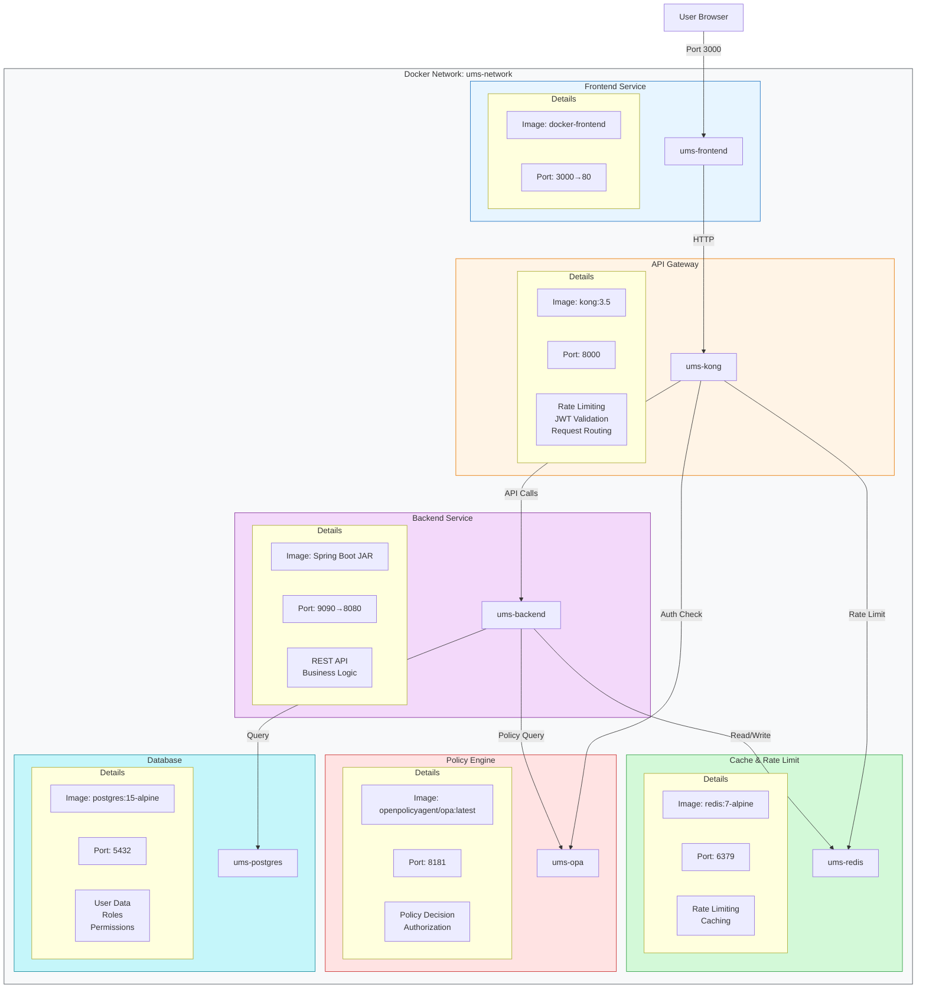
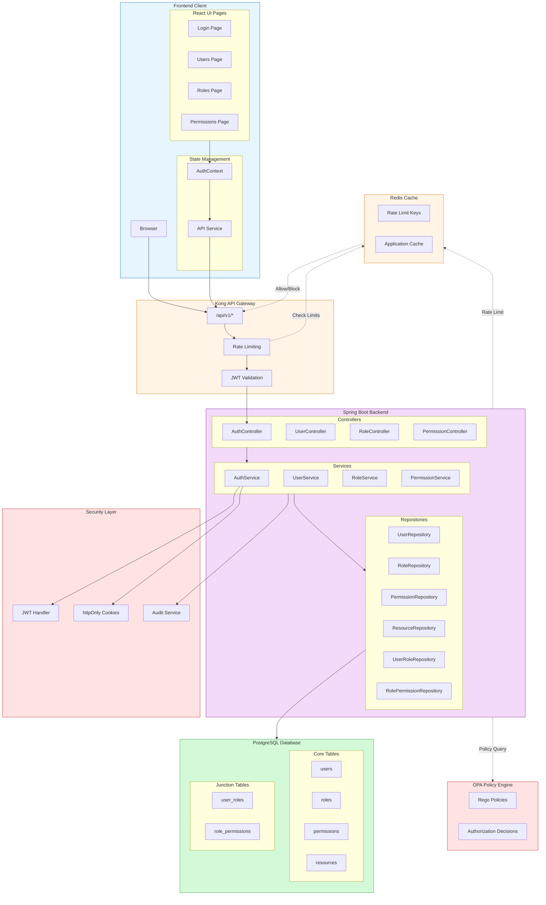
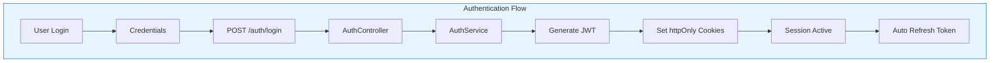
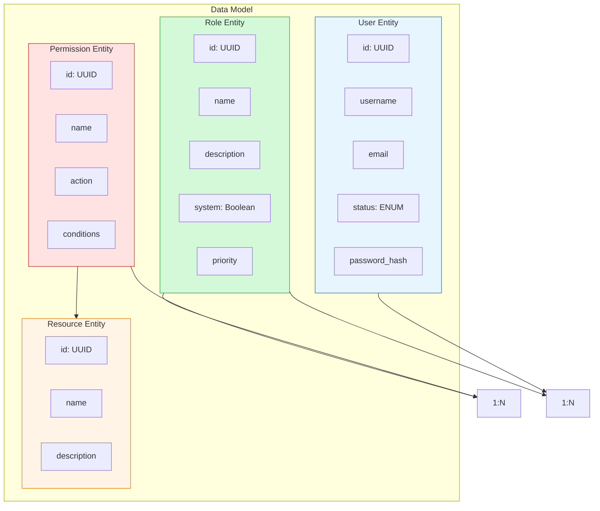
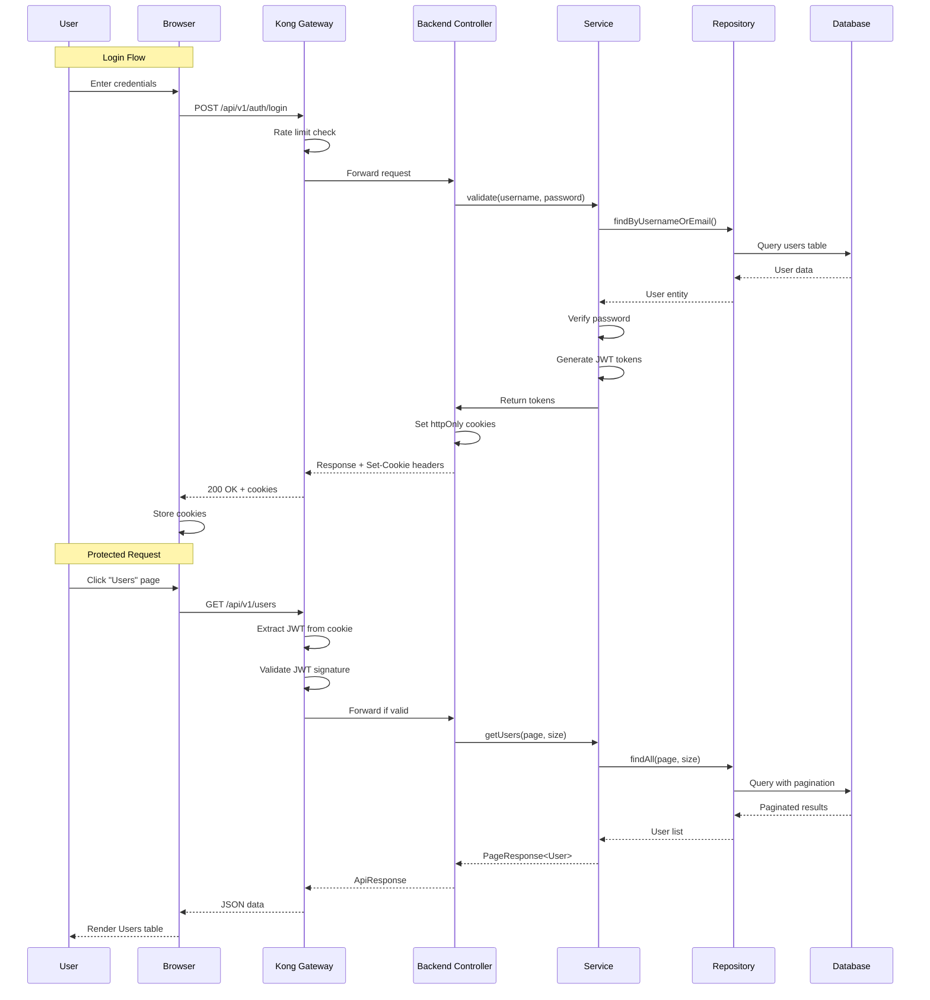

```mermaid
flowchart TB
    subgraph docker_net["Docker Network: ums-network"]

        subgraph frontend_sys["Frontend Service"]
            frontend["ums-frontend"]
            subgraph frontend_det["Details"]
                f_img["Image: docker-frontend"]
                f_port["Port: 3000→80"]
            end
        end

        subgraph gateway_sys["API Gateway"]
            kong["ums-kong"]
            subgraph kong_det["Details"]
                k_img["Image: kong:3.5"]
                k_port["Port: 8000"]
                k_func["Rate Limiting<br/>JWT Validation<br/>Request Routing"]
            end
        end

        subgraph backend_sys["Backend Service"]
            backend["ums-backend"]
            subgraph backend_det["Details"]
                b_img["Image: Spring Boot JAR"]
                b_port["Port: 9090→8080"]
                b_role["REST API<br/>Business Logic"]
            end
        end

        subgraph cache_sys["Cache & Rate Limit"]
            redis["ums-redis"]
            subgraph redis_det["Details"]
                r_img["Image: redis:7-alpine"]
                r_port["Port: 6379"]
                r_func["Rate Limiting<br/>Caching"]
            end
        end

        subgraph opa_sys["Policy Engine"]
            opa["ums-opa"]
            subgraph opa_det["Details"]
                o_img["Image: openpolicyagent/opa:latest"]
                o_port["Port: 8181"]
                o_func["Policy Decision<br/>Authorization"]
            end
        end

        subgraph db_sys["Database"]
            postgres["ums-postgres"]
            subgraph pg_det["Details"]
                p_img["Image: postgres:15-alpine"]
                p_port["Port: 5432"]
                p_data["User Data<br/>Roles<br/>Permissions"]
            end
        end

    end

    %% External connection
    user["User Browser"] -->|Port 3000| frontend

    %% Internal connections
    frontend -->|HTTP| kong
    kong -->|Rate Limit| redis
    kong -->|Auth Check| opa
    kong -->|API Calls| backend
    backend -->|Read/Write| redis
    backend -->|Query| postgres
    backend -->|Policy Query| opa

    %% Styling
    style docker_net fill:#f8f9fa,stroke:#495057
    style frontend_sys fill:#e7f5ff,stroke:#1971c2
    style gateway_sys fill:#fff4e6,stroke:#e67700
    style backend_sys fill:#f3d9fa,stroke:#862e9c
    style cache_sys fill:#d3f9d8,stroke:#2f9e44
    style opa_sys fill:#ffe3e3,stroke:#c92a2a
    style db_sys fill:#c5f6fa,stroke:#0c8599
```

```mermaid
flowchart TB
    subgraph client["Frontend Client"]
        direction TB
        browser["Browser"]
        subgraph ui["React UI Pages"]
            login["Login Page"]
            users["Users Page"]
            roles["Roles Page"]
            permissions["Permissions Page"]
        end
        subgraph state["State Management"]
            auth["AuthContext"]
            api["API Service"]
        end
    end

    subgraph gateway["Kong API Gateway"]
        kong["/api/v1/*"]
        rate["Rate Limiting"]
        authmw["JWT Validation"]
    end

    subgraph backend["Spring Boot Backend"]
        direction TB
        subgraph controllers["Controllers"]
            authc["AuthController"]
            userc["UserController"]
            rolec["RoleController"]
            permc["PermissionController"]
        end

        subgraph services["Services"]
            auths["AuthService"]
            userss["UserService"]
            rolesr["RoleService"]
            perms["PermissionService"]
        end

        subgraph repos["Repositories"]
            userrep["UserRepository"]
            rolerep["RoleRepository"]
            permrep["PermissionRepository"]
            resrep["ResourceRepository"]
            userrolerep["UserRoleRepository"]
            rolepermrep["RolePermissionRepository"]
        end
    end

    subgraph database["PostgreSQL Database"]
        direction TB
        subgraph tables["Core Tables"]
            users_tbl["users"]
            roles_tbl["roles"]
            permissions_tbl["permissions"]
            resources_tbl["resources"]
        end
        subgraph junction["Junction Tables"]
            user_roles["user_roles"]
            role_permissions["role_permissions"]
        end
    end

    subgraph redis["Redis Cache"]
        rlim["Rate Limit Keys"]
        cache["Application Cache"]
    end

    subgraph opa["OPA Policy Engine"]
        policies["Rego Policies"]
        decisions["Authorization Decisions"]
    end

    subgraph security["Security Layer"]
        jwt["JWT Handler"]
        cookies["httpOnly Cookies"]
        audit["Audit Service"]
    end

    %% Connections
    browser --> kong
    kong --> rate
    rate -.->|Check Limits| redis
    redis -.->|Allow/Block| kong
    rate --> authmw
    authmw --> authc

    ui --> auth
    auth --> api
    api --> kong

    controllers --> services
    services --> repos
    repos --> database

    backend -.->|Rate Limit| redis
    backend -.->|Policy Query| opa

    auths --> jwt
    auths --> cookies
    services --> audit

    %% Styling
    style client fill:#e7f5ff,stroke:#1971c2
    style gateway fill:#fff4e6,stroke:#e67700
    style backend fill:#f3d9fa,stroke:#862e9c
    style database fill:#d3f9d8,stroke:#2f9e44
    style redis fill:#fff4e6,stroke:#e67700
    style opa fill:#ffe3e3,stroke:#c92a2a
    style security fill:#ffe3e3,stroke:#c92a2a
```

```mermaid
flowchart LR
    subgraph auth_flow["Authentication Flow"]
        direction LR
        start1["User Login"] --> creds["Credentials"]
        creds --> api["POST /auth/login"]
        api --> backend1["AuthController"]
        backend1 --> svc["AuthService"]
        svc --> jwt["Generate JWT"]
        jwt --> cookie["Set httpOnly Cookies"]
        cookie --> session["Session Active"]
        session --> refresh["Auto Refresh Token"]
    end

    style auth_flow fill:#e7f5ff,stroke:#1971c2
```

```mermaid
flowchart TB
    subgraph data_model["Data Model"]
        direction TB

        subgraph user_entity["User Entity"]
            uid["id: UUID"]
            uname["username"]
            uemail["email"]
            ustatus["status: ENUM"]
            upass["password_hash"]
        end

        subgraph role_entity["Role Entity"]
            rid["id: UUID"]
            rname["name"]
            rdesc["description"]
            rsys["system: Boolean"]
            rprio["priority"]
        end

        subgraph perm_entity["Permission Entity"]
            pid["id: UUID"]
            pname["name"]
            pact["action"]
            pcond["conditions"]
        end

        subgraph res_entity["Resource Entity"]
            resid["id: UUID"]
            resname["name"]
            resdesc["description"]
        end
    end

    %% Relationships
    user_entity --> user_roles["1:N"]
    role_entity --> user_roles["1:N"]
    role_entity --> role_permissions["1:N"]
    perm_entity --> role_permissions["1:N"]
    perm_entity --> res_entity["N:1"]

    style user_entity fill:#e7f5ff,stroke:#1971c2
    style role_entity fill:#d3f9d8,stroke:#2f9e44
    style perm_entity fill:#ffe3e3,stroke:#c92a2a
    style res_entity fill:#fff4e6,stroke:#e67700
```

```mermaid
sequenceDiagram
    participant U as User
    participant B as Browser
    participant K as Kong Gateway
    participant C as Backend Controller
    participant S as Service
    participant R as Repository
    participant D as Database

    Note over U,B: Login Flow
    U->>B: Enter credentials
    B->>K: POST /api/v1/auth/login
    K->>K: Rate limit check
    K->>C: Forward request
    C->>S: validate(username, password)
    S->>R: findByUsernameOrEmail()
    R->>D: Query users table
    D-->>R: User data
    R-->>S: User entity
    S->>S: Verify password
    S->>S: Generate JWT tokens
    S->>C: Return tokens
    C->>C: Set httpOnly cookies
    C-->>K: Response + Set-Cookie headers
    K-->>B: 200 OK + cookies
    B->>B: Store cookies

    Note over U,B: Protected Request
    U->>B: Click "Users" page
    B->>K: GET /api/v1/users
    K->>K: Extract JWT from cookie
    K->>K: Validate JWT signature
    K->>C: Forward if valid
    C->>S: getUsers(page, size)
    S->>R: findAll(page, size)
    R->>D: Query with pagination
    D-->>R: Paginated results
    R-->>S: User list
    S-->>C: PageResponse<User>
    C-->>K: ApiResponse
    K-->>B: JSON data
    B-->>U: Render Users table
```
